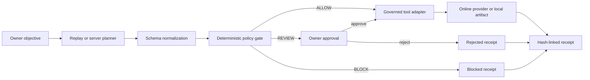

# SolePilot

SolePilot is a governed agent runtime for one-person companies. A reliable
server planner turns an owner objective into tool calls; a deterministic policy engine then
allows, pauses, or blocks every call before it reaches an execution adapter.

**Online product:** https://solepilot.vercel.app

**Replay mirror:** https://feeeeelixwong.github.io/solepilot/

## The problem

Solo founders can delegate research, planning, outreach, and operations to AI
agents. Delegation becomes dangerous when the same agents can contact a
customer, commit to a deadline, or spend money without a clear authority
boundary. Prompt instructions are not an enforcement layer.

SolePilot separates planning from authority:

1. A planner proposes a typed execution plan.
2. The policy engine evaluates each proposed tool call.
3. Routine internal work runs inside delegated authority.
4. External sends, commitments, and spending pause for the owner.
5. Policy violations fail closed before tool invocation.
6. Each terminal outcome is committed to a hash-linked receipt ledger.

## Judge path

The public demo offers two runtime modes:

- **Replay** is a deterministic, zero-configuration run. It requires no account
  or API key and exercises `ALLOW`, `REVIEW`, and `BLOCK` paths.
- **Online agent** generates a typed plan through a no-login same-origin server
  endpoint, retrieves current external evidence through server-side research
  adapters, produces an evidence-backed artifact, and pauses before a real Telegram delivery.
  Delivery requires the owner's connector code and returns a real
  provider message ID. It does not inject synthetic policy violations into a
  normal mission; spending appears only when the objective explicitly requests it.
- **Solana payment** captures an explicit payee, Devnet recipient address, SOL
  amount, owner cap, purpose, deadline, and execution requirements. SolePilot
  seals those fields into the governed action, pauses at the owner boundary,
  and asks the owner's OKX Wallet or Phantom extension to sign the exact
  transfer. A confirmed transaction produces a signature and Solana Explorer
  link in the artifact and receipt ledger.

For the shortest complete run:

1. Select **Run mission** for the zero-configuration policy walkthrough.
2. Inspect the research and drafting artifacts.
3. Approve the paused sandbox outbox call, then continue.
4. Approve the in-budget sandbox reservation, then continue.
5. Observe the over-cap reservation fail before invocation.
6. Open **Receipt ledger** and select **Verify chain**.
7. Create a custom mission and select **Online agent**.
8. Inspect live evidence URLs and the server-attested research request.
9. At the delivery boundary, enter the owner connector code and approve.
10. Inspect the Telegram message ID, provider reference, and sealed receipt.

For a real payment run, select **New mission**, choose **Solana payment**, enter
the vendor and payment instruction, and create the payment mission. Run the
authorization step, inspect the exact recipient and amount in Policy Inspector,
then select **Approve & pay**. The wallet extension remains the final signing
boundary. This public build intentionally supports Solana Devnet only.

Replay external actions remain sandboxed by design. Online work missions use a fixed
Telegram destination protected by a server-side owner code. Spending remains
within the owner cap and sandbox-authorized; over-cap stress testing remains in
Replay. Solana payment missions are non-custodial: the planner never receives a
seed phrase or private key, and the browser asks the owner's wallet extension to
sign only after policy evaluation and explicit approval.

## Runtime architecture



The tool adapter independently re-evaluates policy. Calling it outside the UI
does not bypass governance: reviewed calls require explicit owner
authorization, and blocked calls always throw before execution.

See [ARCHITECTURE.md](./ARCHITECTURE.md) for trust boundaries, receipt details,
and the production replacement plan.

## What is implemented

- Custom mission composition with configurable stakeholder, deadline, and cap
- No-login same-origin server planner with a deterministic local fallback
- Server-side online research using Wikipedia and Hacker News
- Real owner-approved Telegram delivery through a fixed-destination connector
- Structured Solana Devnet payment intents with exact recipient, amount, cap,
  purpose, deadline, and requirement enforcement
- Non-custodial OKX Wallet and Phantom signing with confirmed transaction and
  Explorer evidence
- Provider request IDs, evidence URLs, message IDs, and HMAC attestations
- Deterministic Replay planner for reliable evaluation
- Typed tools for workspace search, document composition, outbox delivery,
  commitments, and budget reservation
- Fail-closed owner policies for sensitive data, budget, and consequential work
- Owner approve/reject queue with resumable execution
- Tool artifacts and an inspectable runtime trace
- Local persistence across refreshes
- Hash-linked receipts with artifact digests and JSON export
- In-browser receipt-chain verification
- Production Next.js API runtime deployed on Vercel
- Responsive keyboard-accessible workspace

## Verification

```bash
npm install
npm test
npm run typecheck
npm run build
```

The test suite covers:

- delegated research
- owner review before external delivery
- over-cap blocking
- canonical serialization
- deterministic receipt IDs
- model-plan normalization
- no-login online plan generation
- evidence-backed drafting without an external model session
- direct tool-adapter bypass attempts
- payment-intent tampering, over-cap payment, and unsigned transfer attempts
- approved sandbox execution
- receipt-chain tamper detection

## Local development

```bash
npm install
npm run dev
```

Open http://localhost:3000. Replay mode works offline after the application has
loaded. Online Agent requires network access to the same-origin planning and
research APIs, but no third-party account or model login.

To enable real Telegram delivery, copy `.env.example` to `.env.local` and set:

```bash
TELEGRAM_BOT_TOKEN=...
TELEGRAM_CHAT_ID=...
SOLEPILOT_OWNER_CODE=...
SOLEPILOT_ATTESTATION_SECRET=...
```

The bot token and destination never reach the browser. The owner code is sent
only when an owner releases a paused action and is not stored in local storage.

## BUIDL_QUESTS 2026

- Primary track: OPC / Super Individuals
- Theme alignment: Autonomous Agents and Sovereignty
- Development started: July 20, 2026
- Repository: built during the official competition window

## License

MIT
