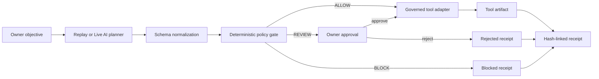

# SolePilot

SolePilot is a governed agent runtime for one-person companies. An AI planner
turns an owner objective into tool calls; a deterministic policy engine then
allows, pauses, or blocks every call before it reaches an execution adapter.

**Live product:** https://feeeeelixwong.github.io/solepilot/

## The problem

Solo founders can delegate research, planning, outreach, and operations to AI
agents. Delegation becomes dangerous when the same agents can contact a
customer, commit to a deadline, or spend money without a clear authority
boundary. Prompt instructions are not an enforcement layer.

SolePilot separates planning from authority:

1. A planner proposes a typed execution plan.
2. The policy engine evaluates each proposed tool call.
3. Routine internal work runs inside delegated authority.
4. External sends, commitments, and spending pause for the owner.
5. Policy violations fail closed before tool invocation.
6. Each terminal outcome is committed to a hash-linked receipt ledger.

## Judge path

The public demo offers two planner modes:

- **Replay** is a deterministic, zero-configuration run. It requires no account
  or API key and exercises `ALLOW`, `REVIEW`, and `BLOCK` paths.
- **Live AI** asks a Puter-hosted OpenAI model to generate a new typed plan from
  the owner's objective. Puter's user-pays session keeps model credentials out
  of the application and may request a Puter sign-in.

For the shortest complete run:

1. Select **Run mission**.
2. Inspect the research and drafting artifacts.
3. Approve the paused sandbox outbox call, then continue.
4. Approve the in-budget sandbox reservation, then continue.
5. Observe the over-cap reservation fail before invocation.
6. Open **Receipt ledger** and select **Verify chain**.
7. Create a custom mission to compare Replay with Live AI planning.

External messages, commitments, and payments intentionally use sandbox
adapters in this public build. The runtime proves authorization and execution
ordering without creating unintended real-world side effects.

## Runtime architecture



The tool adapter independently re-evaluates policy. Calling it outside the UI
does not bypass governance: reviewed calls require explicit owner
authorization, and blocked calls always throw before execution.

See [ARCHITECTURE.md](./ARCHITECTURE.md) for trust boundaries, receipt details,
and the production replacement plan.

## What is implemented

- Custom mission composition with configurable stakeholder, deadline, and cap
- Keyless Live AI planner through Puter.js
- Deterministic Replay planner for reliable evaluation
- Typed tools for workspace search, document composition, outbox delivery,
  commitments, and budget reservation
- Fail-closed owner policies for sensitive data, budget, and consequential work
- Owner approve/reject queue with resumable execution
- Tool artifacts and an inspectable runtime trace
- Local persistence across refreshes
- Hash-linked receipts with artifact digests and JSON export
- In-browser receipt-chain verification
- Responsive keyboard-accessible workspace

## Verification

```bash
npm install
npm test
npm run typecheck
npm run build
```

The test suite covers:

- delegated research
- owner review before external delivery
- over-cap blocking
- canonical serialization
- deterministic receipt IDs
- model-plan normalization
- direct tool-adapter bypass attempts
- approved sandbox execution
- receipt-chain tamper detection

## Local development

```bash
npm install
npm run dev
```

Open http://localhost:3000. Replay mode works offline after the application has
loaded. Live AI requires network access to Puter.js.

## BUIDL_QUESTS 2026

- Primary track: OPC / Super Individuals
- Theme alignment: Autonomous Agents and Sovereignty
- Development started: July 20, 2026
- Repository: built during the official competition window

## License

MIT
