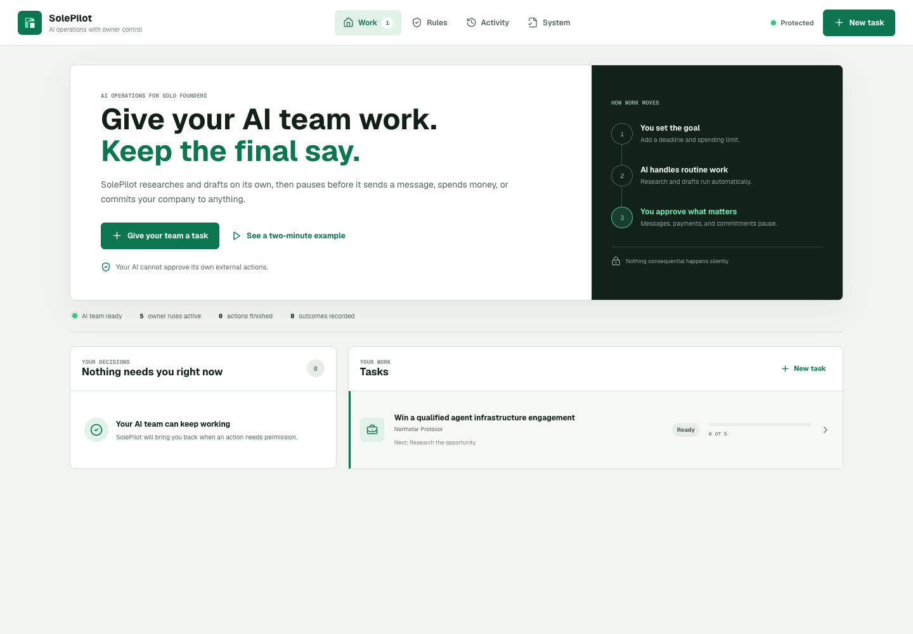
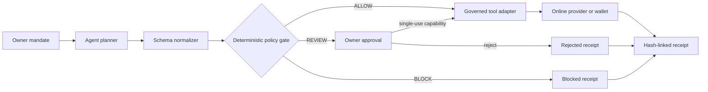

<p align="center">
  
</p>

<h1 align="center">SolePilot</h1>

<p align="center"><strong>Let agents operate. Never let them grant themselves authority.</strong></p>

<p align="center">
  A governed mission control plane for one-person companies. Agent workflows
  execute delegated work, pause at owner boundaries, fail closed on policy
  violations, and commit every outcome to a verifiable receipt chain.
</p>

<p align="center">
  <a href="https://solepilot.vercel.app"><strong>Live product</strong></a> ·
  <a href="./EVIDENCE.md">Evidence map</a> ·
  <a href="./ARCHITECTURE.md">Architecture</a> ·
  <a href="./SECURITY.md">Security review</a> ·
  <a href="https://openarena.to/en/projects/cmrsq528y000004juvcenfwl5">OpenArena submission</a>
</p>

<p align="center">
  <a href="https://openarena.to/en/projects/cmrsq528y000004juvcenfwl5"></a>
</p>



## The problem

A solo founder can delegate research, drafting, outreach, operations, and
payments to agents. But a prompt such as "ask before spending" is not an
enforcement layer. The same model that proposes an action must not be allowed
to authorize it.

SolePilot separates **planning** from **authority**. Model output is treated as
an untrusted proposal until a typed action passes deterministic policy and the
governed tool adapter independently checks the result again.

## The five-part story

**1. Agents receive bounded mandates, not blank checks.** The owner defines the
objective, stakeholder, deadline, budget cap, and payment intent. The planner
can propose only known action kinds and allow-listed tools.

**2. Policy runs before the tool.** Every action resolves to `ALLOW`, `REVIEW`,
or `BLOCK`. Routine internal work proceeds. External sends, commitments, and
payments pause. Violations fail before connector invocation.

**3. Approval is a capability, not a boolean.** Owner approval issues a
five-minute, single-use capability bound to the full action, mission, policy
result, and nonce. Reuse or mutation fails closed.

**4. Real integrations preserve the trust boundary.** Online research uses
current external evidence and server-attested results. Telegram uses a fixed
server-side destination plus an owner code. Solana payment remains
non-custodial: the wallet extension signs the exact Devnet transfer after
policy and owner review.

**5. Every terminal outcome becomes proof.** A receipt commits the policy
decision, owner capability, artifact digest, outcome, sequence, and previous
receipt hash. The product exposes the canonical payload and verifies the chain
in-browser.

## Proof, not promises

| Surface | Competition build | Verification |
| --- | --- | --- |
| Planner | Live same-origin typed planner | `POST /api/plans` |
| Research | Wikipedia + Hacker News evidence | provider URLs + request ID |
| Delivery | Owner-approved Telegram connector | provider message ID + attestation |
| Policy | Deterministic pre-tool gate | 24 focused tests |
| Approval | Single-use action capability | replay and mutation negative tests |
| Payment | OKX Wallet / Phantom, Solana Devnet | wallet signature + Explorer URL |
| Audit | Hash-linked canonical receipts | in-browser verification + JSON export |

Run the deployed proof from a terminal:

```bash
npm install
npm run smoke:live
```

The smoke test exercises the online planner, retrieves live research evidence,
verifies its server attestation, then submits an invalid over-cap payment
intent and asserts that the server fails closed. See [EVIDENCE.md](./EVIDENCE.md)
for the complete claim-to-proof matrix and honest deployment labels.

## Architecture


```mermaid
flowchart LR
  O["Owner mandate"] --> P["Agent planner"]
  P --> N["Schema normalizer"]
  N --> G{"Deterministic policy gate"}
  G -->|ALLOW| T["Governed tool adapter"]
  G -->|REVIEW| A["Owner approval"]
  A -->|single-use capability| T
  A -->|reject| R["Rejected receipt"]
  G -->|BLOCK| B["Blocked receipt"]
  T --> X["Online provider or wallet"]
  X --> H["Hash-linked receipt"]
  R --> H
  B --> H
```

`executeGovernedAction` evaluates policy again at the tool boundary. Calling a
connector outside the UI does not bypass governance: reviewed calls require a
matching unexpired capability, and blocked calls throw before execution.

Read [ARCHITECTURE.md](./ARCHITECTURE.md) for trust boundaries, receipt
construction, online connector design, payment routing, limitations, and the
production replacement plan. [SECURITY.md](./SECURITY.md) documents the threat
model, enforced invariants, adversarial test coverage, and remaining risks.

## 90-second judge path

1. Open [the live product](https://solepilot.vercel.app) and select **Proof**.
2. Select **Start 90-second proof**, then **Run mission**.
3. Inspect the delegated research and drafting artifacts.
4. Approve or reject the paused external send.
5. Continue until the over-cap reservation is blocked before invocation.
6. Open **Ledger**, expand a receipt, and inspect its canonical payload.
7. Select **Verify chain**.

Replay requires no account or API key. For a real online mission, create a new
**Work delivery** mission and choose **Online agent**. For a wallet-dependent
flow, create a **Governed payment** mission and inspect the exact recipient,
amount, cap, purpose, and requirements before approving the Devnet signature.

## What is implemented

- Multi-mission control plane with independent resumable runtimes
- Typed server and deterministic replay planners
- Deterministic `ALLOW`, `REVIEW`, and `BLOCK` policy outcomes
- Policy re-evaluation at the governed tool boundary
- Five-minute, single-use, action-bound owner capabilities
- Live public research with request IDs, evidence URLs, and HMAC attestations
- Real fixed-destination Telegram delivery behind an owner connector code
- Chain-neutral payment intents and an executable Solana Devnet adapter
- Non-custodial OKX Wallet and Phantom signing
- Hash-linked receipts with artifact digests and canonical payload inspection
- In-browser chain verification and JSON export
- Local-first, versioned multi-mission persistence
- Responsive keyboard-accessible control plane

## Verification

```bash
npm install
npm test
npm run typecheck
npm run build
npm run smoke:live
```

The focused test suite covers routine delegation, owner review, over-cap
blocking, canonical serialization, deterministic receipts, typed online plans,
payment-intent tampering, expired intents, unsigned transfers, direct adapter
bypass attempts, capability replay, changed-action attempts, live evidence
artifacts, and receipt-chain tampering.

## Local development

```bash
npm install
npm run dev
```

Open `http://localhost:3000`. Replay works without credentials. To enable all
online connectors, copy `.env.example` to `.env.local` and set:

```bash
TELEGRAM_BOT_TOKEN=...
TELEGRAM_CHAT_ID=...
SOLEPILOT_OWNER_CODE=...
SOLEPILOT_ATTESTATION_SECRET=...
```

Provider tokens and the Telegram destination never reach the browser. Approval
capabilities are not persisted. SolePilot never receives a wallet private key.

## Deployment boundary

This competition build is explicit about what is real:

- **Replay:** real governance and receipts, sandbox tool outputs.
- **Online Agent:** real Vercel APIs, external research, attestations, and
  owner-approved Telegram delivery.
- **Solana payment:** real non-custodial wallet path on Devnet only.
- **Production plan:** tenant storage, passkey approvals, and mainnet adapters
  are documented replacements, not hidden claims.

## BUIDL_QUESTS 2026

- Primary track: OPC / Super Individuals
- Theme alignment: Autonomous Agents and Sovereignty
- Development started: July 20, 2026
- Public product: https://solepilot.vercel.app
- OpenArena: https://openarena.to/en/projects/cmrsq528y000004juvcenfwl5

## License

MIT
